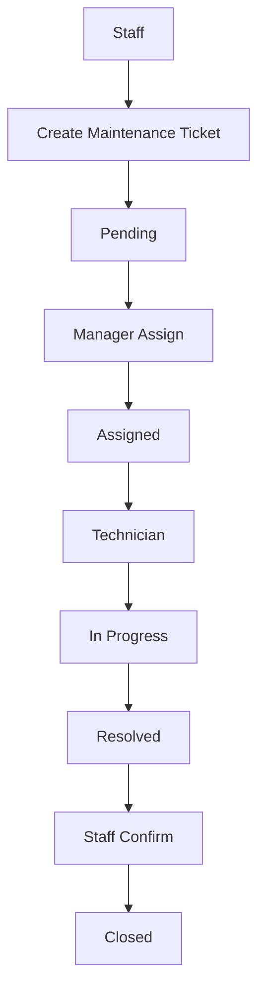
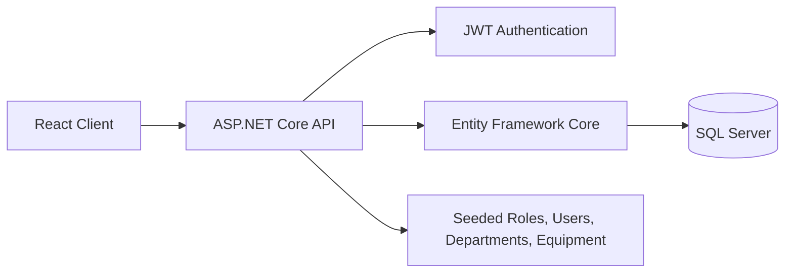

# Office Facility Maintenance Management System

> A web-based internal platform for ABC Technology to manage office equipment maintenance across 300 employees, 8 departments, and 400+ office assets. It replaces fragmented reporting channels with one auditable workflow from request creation to closure.

[]()
[]()
[]()
[]()

## Hero Description

Office Facility Maintenance Management System is designed for a modern office environment, not a factory, hospital, or residential building. It centralizes maintenance requests for office equipment such as printers, projectors, air conditioners, CCTV, meeting room TVs, attendance machines, and network devices into a single operational system.

The goal is simple: give staff a clear way to report issues, help managers assign work efficiently, and give technicians a structured process for resolving tickets with full traceability.

## Overview

ABC Technology previously handled maintenance requests through phone calls, email, Microsoft Teams, and Zalo. Those channels were convenient, but they created operational blind spots:

- requests were easy to miss
- the same issue could be reported multiple times
- maintenance history was scattered
- workload tracking was difficult
- managers had limited visibility into day-to-day operations

This system replaces that fragmented process with a centralized ticketing workflow. Every request is captured in one place, every status change is recorded, and every asset is linked to its department and maintenance history.

## Business Problem

In a growing office environment, maintenance work becomes hard to control when reporting is informal and spread across multiple communication channels.

At ABC Technology, staff used:

- Phone Call
- Email
- Microsoft Teams
- Zalo

This caused several business problems:

- Lost maintenance requests
- Duplicate repairs
- No maintenance history
- Difficult workload tracking
- Poor operational visibility

Without a structured system, the facility team and IT support team cannot easily answer basic questions such as which asset is under maintenance, who is responsible for it, or how long a request has been pending.

## Solution

This platform solves the problem by turning maintenance into a controlled, role-based workflow.

- Staff create tickets from a single system instead of sending ad hoc messages.
- Managers assign the right technician based on department and workload.
- Technicians update ticket progress in a controlled status flow.
- Every change is tracked so the full maintenance history is preserved.
- Equipment, departments, users, and tickets are connected, which improves visibility and accountability.

The result is a more predictable maintenance process, better reporting, and a cleaner audit trail for internal operations.

## Demo

This repository does not include a public live deployment yet.

- Backend Swagger UI is available in development mode at `http://localhost:5253/swagger`
- The frontend is included as a React + Vite scaffold and can be extended into the main UI
- Add screenshots or a short GIF in `docs/` when the interface is ready for presentation

## Core Features

### Authentication

- JWT-based login
- Current user profile lookup
- Password change flow

### User Management

- Admin-only user directory
- Role-aware user access
- Department-aware user assignment
- Active status and password reset support

### Department Management

- Department CRUD
- Uniqueness protection for department names
- Dependency checks before deletion

### Equipment Management

- Office asset CRUD
- Department ownership for each asset
- Immutable equipment code
- Support for equipment categories such as printers, projectors, air conditioners, CCTV, meeting room TVs, attendance machines, and network devices

### Maintenance Workflow

- Ticket creation and update flow
- Manager assignment step
- Technician execution step
- Ticket comments
- Ticket history tracking
- Controlled status transitions

### Administration

- Role-based access control
- Seeded master data for local development
- Operational data structure suitable for reporting and oversight

## Business Workflow



This workflow keeps ownership clear at each stage and makes the maintenance process easy to audit.

## Tech Stack

**Frontend:** React 19, TypeScript, Vite  
**Backend:** ASP.NET Core 10, Entity Framework Core, JWT Authentication, BCrypt.Net-Next, Swagger/OpenAPI  
**Database:** Microsoft SQL Server 2022  
**DevOps & Tooling:** Docker Compose, pnpm, ESLint

## System Architecture

```text
InternalMaintenanceManagement.slnx
|-- InternalMaintenance.Api/      # ASP.NET Core Web API
|   |-- Controllers/              # Auth, Department, Equipment, Ticket, and User APIs
|   |-- Constants/                # Shared status and role constants
|   |-- Data/                     # DbContext and seed data
|   |-- DTOs/                     # Request and response models
|   |-- Migrations/               # EF Core migrations
|   |-- Models/                   # Domain entities
|   `-- Services/                 # JWT and current user helpers
|-- InternalMaintenance.Client/   # React + Vite frontend scaffold
`-- docker-compose.yml            # SQL Server development container
```



The API applies database initialization and seed data on startup, which makes local development predictable and repeatable.

## Project Structure

```text
InternalMaintenanceManagement.slnx
|-- InternalMaintenance.Api/
|   |-- Controllers/
|   |-- Constants/
|   |-- Data/
|   |-- DTOs/
|   |-- Migrations/
|   |-- Models/
|   `-- Services/
|-- InternalMaintenance.Client/
|   |-- src/
|   |-- public/
|   `-- vite.config.ts
`-- docker-compose.yml
```

## API Modules

### API Endpoint List

### Authentication

- `POST /api/auth/login`
- `GET /api/auth/me`
- `POST /api/auth/change-password`

### Users

- `GET /api/users`
- `GET /api/users/{id}`
- `POST /api/users`
- `PUT /api/users/{id}`
- `PUT /api/users/{id}/active`
- `POST /api/users/{id}/reset-password`

`GET /api/users` supports these query parameters:

- `keyword`
- `role`
- `departmentId`
- `isActive`
- `page`
- `pageSize`

### Departments

- `GET /api/departments`
- `GET /api/departments/{id}`
- `POST /api/departments`
- `PUT /api/departments/{id}`
- `DELETE /api/departments/{id}`

### Equipment

- `GET /api/equipment`
- `GET /api/equipment/{id}`
- `POST /api/equipment`
- `PUT /api/equipment/{id}`
- `DELETE /api/equipment/{id}`

### Maintenance Tickets

- `GET /api/tickets`
- `GET /api/tickets/{id}`
- `POST /api/tickets`
- `PUT /api/tickets/{id}`
- `PATCH /api/tickets/{id}/assign`
- `PATCH /api/tickets/{id}/status`
- `POST /api/tickets/{id}/comments`
- `GET /api/tickets/{id}/comments`
- `GET /api/tickets/{id}/history`

### Example Requests

```bash
curl -X POST http://localhost:5253/api/auth/login ^
  -H "Content-Type: application/json" ^
  -d "{\"email\":\"admin@test.com\",\"password\":\"Temp@123456\"}"
```

```bash
curl -X POST http://localhost:5253/api/departments ^
  -H "Content-Type: application/json" ^
  -H "Authorization: Bearer YOUR_ACCESS_TOKEN" ^
  -d "{\"name\":\"Facilities\",\"description\":\"Facilities and building maintenance\"}"
```

```bash
curl -X POST http://localhost:5253/api/tickets ^
  -H "Content-Type: application/json" ^
  -H "Authorization: Bearer YOUR_ACCESS_TOKEN" ^
  -d "{\"title\":\"Printer jam\",\"description\":\"Paper keeps getting stuck\",\"equipmentId\":1,\"createdByUserId\":3,\"priority\":\"Medium\"}"
```

```bash
curl -X POST http://localhost:5253/api/tickets/1/comments ^
  -H "Content-Type: application/json" ^
  -H "Authorization: Bearer YOUR_ACCESS_TOKEN" ^
  -d "{\"content\":\"Technician arrived on site and is checking the issue.\"}"
```

## Getting Started

### Installation Guide

#### Prerequisites

- .NET 10 SDK
- Node.js LTS
- pnpm
- Docker Desktop
- Microsoft SQL Server 2022, or the provided Docker Compose setup

#### Configuration

Create a local `.env` file from the example:

```bash
Copy-Item .env.example .env
```

The backend reads its connection string from `ConnectionStrings__DefaultConnection`, so you can keep secrets out of `appsettings.json`.

#### Start the Database

```bash
docker compose up -d
```

#### Start the API

```bash
dotnet restore InternalMaintenance.Api/InternalMaintenance.Api.csproj
dotnet run --project InternalMaintenance.Api
```

The API runs at:

- `http://localhost:5253`
- `https://localhost:7237`

Swagger is available in Development mode at:

- `http://localhost:5253/swagger`

#### Start the Frontend

```bash
cd InternalMaintenance.Client
pnpm install
pnpm dev
```

The Vite app typically runs on `http://localhost:5173`.

### Docker Commands

```bash
docker compose up -d
docker compose down
```

## Environment Variables

| Variable | Purpose | Example |
| --- | --- | --- |
| `ConnectionStrings__DefaultConnection` | SQL Server connection string used by the API | `Server=localhost,1433;Database=InternalMaintenanceDb;User Id=sa;Password=YourStrong!Passw0rd;TrustServerCertificate=True;Encrypt=False` |
| `Jwt__Key` | Secret key used to sign JWT access tokens | `replace-with-a-long-random-secret` |
| `Jwt__Issuer` | JWT issuer claim | `InternalMaintenance.Api` |
| `Jwt__Audience` | JWT audience claim | `InternalMaintenance.Client` |
| `Jwt__ExpiresInMinutes` | Token lifetime in minutes | `60` |
| `MSSQL_SA_PASSWORD` | SQL Server SA password for Docker Compose | `YourStrong!Passw0rd` |
| `SQLSERVER_PORT` | Local port exposed by the SQL Server container | `1433` |

## Demo Accounts

ABC Technology demo data is seeded on startup so the application can be explored immediately in a local environment.

Temporary password for seeded accounts:

```text
Temp@123456
```

Seeded demo users:

- `admin@test.com`
- `manager@test.com`
- `technician@test.com`
- `staff@test.com`

All seeded users are marked as `MustChangePassword = true` on first login.

## Business Rules

- One equipment item cannot have multiple active maintenance tickets.
- Closed tickets cannot be modified.
- Equipment code is immutable after creation.
- A department cannot be deleted if users or equipment still exist.
- Every ticket status change is recorded in history.
- A resolution note is required before resolving a ticket.

## Roadmap

### v1.0

- Authentication
- RBAC
- Department
- Equipment
- Maintenance Ticket
- Ticket History

### v1.1

- QR Code
- Attachment Upload
- Email Notification

### v1.2

- Preventive Maintenance
- Maintenance Schedule
- SLA Dashboard

### v2.0

- Multi Building
- Multi Tenant
- Subscription
- Analytics

## Future Enhancements

- QR Code per Equipment
- Preventive Maintenance
- Email Notification
- Attachment Upload
- SLA Monitoring
- Multi-building Support
- Multi-tenant SaaS

## Contributing

Pull requests are welcome. For larger changes, please open an issue first so we can align on scope and direction.

## License

No license file is currently included in this repository.
