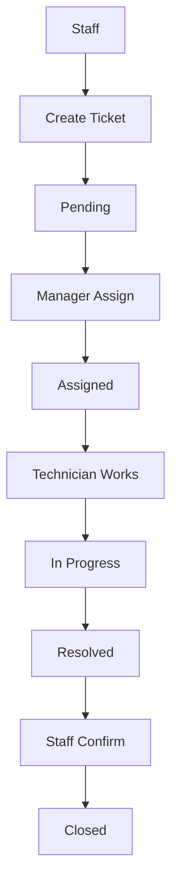
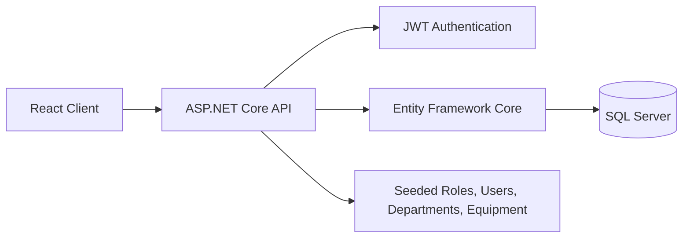

# Office Facility Maintenance Management System

> A web-based internal platform for managing office equipment maintenance across departments, technicians, and staff. It centralizes requests, assignment, status tracking, comments, and history into one auditable workflow.

[]()
[]()
[]()
[]()

## About

Office Facility Maintenance Management System is an internal maintenance platform built for an office environment. It is designed for office assets such as printers, routers, air conditioners, meeting-room devices, and other shared equipment that need structured maintenance handling.

The system helps:

- staff report issues in one place
- managers assign work with better visibility
- technicians update progress in a controlled workflow
- administrators maintain users, departments, and equipment
- the organization keep a clear history of every ticket

## Business Context

Before this system, maintenance requests were typically handled through scattered channels such as phone calls, email, chat tools, or direct messages. That approach makes it easy to miss requests, duplicate work, and lose operational history.

This project replaces that fragmented process with a centralized workflow so the team can:

- capture every request consistently
- track who created, assigned, and resolved each ticket
- connect each maintenance request to a department and an equipment item
- review ticket history and comments later for audit and reporting

## Current Scope

The repository currently contains:

- an ASP.NET Core Web API backend
- a React + Vite frontend
- JWT authentication with refresh tokens
- role-based access control
- department, equipment, user, and maintenance ticket modules
- seeded demo data for local development

The frontend currently includes:

- `Login`
- `Dashboard`
- `Tickets`

The UI is prepared to grow into a fuller operational console, with API hooks already organized for auth, tickets, equipment, users, and related flows.

## Key Features

### Authentication

- JWT login
- current user profile lookup
- password change
- refresh token rotation
- logout via refresh-token revocation

### User Management

- admin-only user directory
- role-aware access
- department assignment
- active/inactive status control
- reset password support
- new Admin accounts are not created from the user-management form; existing Admin accounts can still be maintained

### Department Management

- create, update, read, delete departments
- unique department name protection
- dependency checks before deletion

### Equipment Management

- create, update, read, delete equipment
- equipment assigned to a department
- immutable equipment code after creation
- support for office asset tracking

### Maintenance Tickets

- create maintenance requests
- view ticket queue and detail
- assign technicians
- change ticket status through workflow rules
- add comments
- track status history
- store resolution notes and timestamps

## Business Workflow



## Access Model

The backend uses role-based access control:

- `Admin`
- `Manager`
- `Staff`
- `Technician`

Ticket visibility is filtered by role:

- `Admin` can access all tickets
- `Manager` can access tickets in their department
- `Staff` can access tickets they created
- `Technician` can access tickets assigned to them

## Tech Stack

**Frontend:** React 19, TypeScript, Vite, TanStack Query, React Router, Zustand, React Hook Form, Zod  
**Backend:** ASP.NET Core 10, Entity Framework Core, JWT Authentication, BCrypt.Net-Next, Swagger/OpenAPI  
**Database:** Microsoft SQL Server 2022  
**Tooling:** Docker Compose, pnpm, ESLint, Vitest

## Repository Structure

```text
InternalMaintenanceManagement.slnx
|-- InternalMaintenance.Api/           # ASP.NET Core Web API
|   |-- Common/                         # Query and pagination helpers
|   |-- Constants/                      # Shared role, status, and priority constants
|   |-- Data/                           # DbContext and seed data
|   |-- Extensions/                     # Startup and pipeline wiring
|   |-- Migrations/                     # EF Core migrations
|   |-- Models/                         # Domain entities
|   |-- Modules/                        # Feature modules
|   |   |-- Auth/
|   |   |-- Departments/
|   |   |-- Equipment/
|   |   |-- Tickets/
|   |   `-- Users/
|   `-- Services/                       # JWT, current user, ticket code generation
|-- InternalMaintenance.Client/         # React + Vite frontend
|   |-- src/
|   |   |-- app/
|   |   |-- features/
|   |   |-- entities/
|   |   |-- pages/
|   |   |-- shared/
|   |   `-- main.tsx
|   `-- public/
|-- docker-compose.yml                  # SQL Server development container
|-- .env.example
`-- README.md
```

## System Architecture



The backend is organized as a modular monolith, which keeps feature boundaries clear without splitting the system into many separate services too early.

## API Modules

### Authentication

- `POST /api/auth/login`
- `GET /api/auth/me`
- `POST /api/auth/change-password`
- `POST /api/auth/refresh-token`
- `POST /api/auth/logout`

### Users

- `GET /api/users`
- `GET /api/users/{id}`
- `POST /api/users`
- `PUT /api/users/{id}`
- `PATCH /api/users/{id}/status`
- `PATCH /api/users/{id}/reset-password`

Supported query parameters for `GET /api/users`:

- `keyword`
- `role`
- `departmentId`
- `isActive`
- `page`
- `pageSize`

### Departments

- `GET /api/departments`
- `GET /api/departments/{id}`
- `POST /api/departments`
- `PUT /api/departments/{id}`
- `DELETE /api/departments/{id}`

Supported query parameters for `GET /api/departments`:

- `keyword`
- `page`
- `pageSize`

### Equipment

- `GET /api/equipment`
- `GET /api/equipment/{id}`
- `POST /api/equipment`
- `PUT /api/equipment/{id}`
- `DELETE /api/equipment/{id}`

Supported query parameters for `GET /api/equipment`:

- `keyword`
- `status`
- `departmentId`
- `page`
- `pageSize`

### Maintenance Tickets

- `GET /api/tickets`
- `GET /api/tickets/{id}`
- `POST /api/tickets`
- `PUT /api/tickets/{id}`
- `PATCH /api/tickets/{id}/assign`
- `PATCH /api/tickets/{id}/status`
- `POST /api/tickets/{id}/comments`
- `GET /api/tickets/{id}/comments`
- `GET /api/tickets/{id}/history`

Supported query parameters for `GET /api/tickets`:

- `status`
- `priority`
- `equipmentId`
- `page`
- `pageSize`

Ticket statuses:

- `Pending`
- `Assigned`
- `InProgress`
- `Resolved`
- `Closed`
- `Cancelled`

Ticket priorities:

- `Low`
- `Medium`
- `High`
- `Critical`

## Ticket Workflow Rules

- A ticket can be cancelled from `Pending` or `Assigned`
- A ticket can move from `Assigned` to `InProgress`
- A ticket can move from `InProgress` to `Resolved`
- A ticket can move from `Resolved` to `Closed`
- A resolution note is required before resolving a ticket
- Closed tickets should not be modified
- Every status change is stored in history

## Seeded Demo Data

The API seeds local data on startup so the project can be explored immediately.

Seeded roles:

- `Admin`
- `Manager`
- `Staff`
- `Technician`

Seeded departments:

- `IT`
- `Accounting`
- `HR`

Seeded users:

- `admin@test.com`
- `manager@test.com`
- `staff@test.com`
- `technician@test.com`

Seeded equipment includes:

- `PRN-ACC-001` - Canon Printer - Accounting Room
- `RTR-IT-001` - Main Office Router

Temporary password for seeded accounts:

```text
Temp@123456
```

Seeded users are marked `MustChangePassword = true` on first login.

## Getting Started

### Prerequisites

- .NET 10 SDK
- Node.js LTS
- pnpm
- Docker Desktop
- Microsoft SQL Server 2022, or Docker Compose

### Configuration

Create a local `.env` file from the example:

```powershell
Copy-Item .env.example .env
```

### Environment Variables

| Variable | Purpose | Example |
| --- | --- | --- |
| `ConnectionStrings__DefaultConnection` | SQL Server connection string used by the API | `Server=localhost,1433;Database=InternalMaintenanceDb;User Id=sa;Password=YourStrongPassword;TrustServerCertificate=True;Encrypt=False` |
| `Jwt__Key` | Secret key used to sign JWT access tokens | `replace-with-a-long-random-secret` |
| `Jwt__Issuer` | JWT issuer claim | `InternalMaintenance.Api` |
| `Jwt__Audience` | JWT audience claim | `InternalMaintenance.Client` |
| `Jwt__ExpiresInMinutes` | Token lifetime in minutes | `60` |
| `MSSQL_SA_PASSWORD` | SQL Server SA password for Docker Compose | `YourStrongPassword` |
| `SQLSERVER_PORT` | Local port exposed by the SQL Server container | `1433` |

### Start the Database

```powershell
docker compose up -d
```

### Start the API

```powershell
dotnet restore InternalMaintenance.Api/InternalMaintenance.Api.csproj
dotnet run --project InternalMaintenance.Api
```

API URLs:

- `http://localhost:5253`
- `https://localhost:7237`

Swagger:

- `http://localhost:5253/swagger`

### Start the Frontend

```powershell
cd InternalMaintenance.Client
pnpm install
pnpm dev
```

Vite dev server:

- `http://localhost:5173`

## Frontend Notes

The client app is built with React + Vite and is structured with feature-oriented folders:

- `app/` for routing, layouts, providers, and guards
- `features/` for auth and ticket-related UI logic
- `entities/` for shared domain types
- `pages/` for route-level screens
- `shared/` for API clients, UI primitives, config, and helpers

The API proxy in `vite.config.ts` forwards:

- `/api` to `http://localhost:5253`
- `/swagger` to `http://localhost:5253`

Useful scripts in `InternalMaintenance.Client/package.json`:

- `pnpm dev`
- `pnpm build`
- `pnpm lint`
- `pnpm test`
- `pnpm test:run`
- `pnpm format`
- `pnpm format:check`
- `pnpm generate:api`

## Business Rules

- One equipment item cannot have multiple active maintenance tickets
- Equipment code is immutable after creation
- A department cannot be deleted if related users or equipment still exist
- Every ticket status change is recorded
- A resolution note is required before a ticket can be resolved
- Ticket visibility depends on role and department

## Roadmap

### Next Improvements

- QR code for equipment
- attachment upload for tickets
- email notification
- preventive maintenance scheduling
- SLA dashboard
- richer analytics

### Longer-Term Ideas

- multi-building support
- multi-tenant support
- subscription model
- reporting and forecasting

## Contributing

Pull requests are welcome. For larger changes, please open an issue first so scope and direction can be aligned.

## License

No license file is currently included in this repository.
