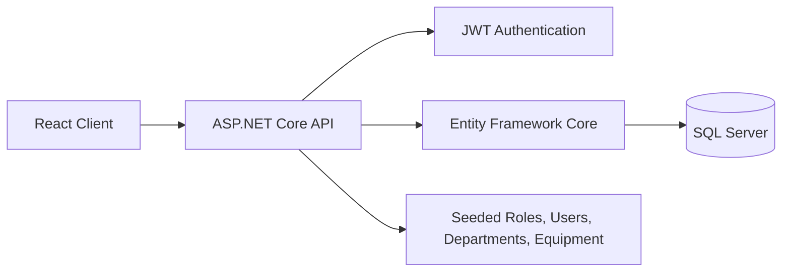

# Internal Maintenance Management System

> A full-stack internal maintenance platform for managing departments, equipment, users, and maintenance tickets with JWT-based authentication and ticket history tracking.

[]()
[]()
[]()
[]()

## Demo

This repository does not include a deployed live demo yet.

- Backend Swagger UI is available in development mode at `http://localhost:5253/swagger`
- The frontend is included as a React + Vite scaffold and can be extended into the main UI
- Add a real screenshot or GIF in `docs/` when the UI is ready for presentation

## Tech Stack

**Frontend:** React 19, TypeScript, Vite  
**Backend:** ASP.NET Core 10, Entity Framework Core, JWT Authentication, BCrypt.Net-Next, Swagger/OpenAPI  
**Database:** Microsoft SQL Server 2022  
**DevOps & Tooling:** Docker Compose, pnpm, ESLint

## Features

- JWT login, profile lookup, and password change flow
- Role-based users: Admin, Manager, Staff, Technician
- Department management with dependency checks
- Equipment management with unique equipment codes and department ownership
- Maintenance ticket creation, assignment, status workflow, comments, and history tracking
- Admin-only user directory with filtering and paged results
- Automatic database migration and seed data on application startup

## Getting Started

### Prerequisites

- .NET 10 SDK
- Node.js LTS
- pnpm
- Docker Desktop
- Microsoft SQL Server 2022, or the provided Docker Compose setup

### Configuration

Create a local `.env` file from the example:

```bash
Copy-Item .env.example .env
```

The backend reads its connection string from `ConnectionStrings__DefaultConnection`, so you can keep secrets out of `appsettings.json`.

### Start the Database

```bash
docker compose up -d
```

### Start the API

```bash
dotnet restore InternalMaintenance.Api/InternalMaintenance.Api.csproj
dotnet run --project InternalMaintenance.Api
```

The API runs at:

- `http://localhost:5253`
- `https://localhost:7237`

Swagger is available in Development mode at:

- `http://localhost:5253/swagger`

### Start the Frontend

```bash
cd InternalMaintenance.Client
pnpm install
pnpm dev
```

The Vite app typically runs on `http://localhost:5173`.

## Environment Variables

| Variable | Purpose | Example |
| --- | --- | --- |
| `ConnectionStrings__DefaultConnection` | SQL Server connection string used by the API | `Server=localhost,1433;Database=InternalMaintenanceDb;User Id=sa;Password=YourStrong!Passw0rd;TrustServerCertificate=True;Encrypt=False` |
| `Jwt__Key` | Secret key used to sign JWT access tokens | `replace-with-a-long-random-secret` |
| `Jwt__Issuer` | JWT issuer claim | `InternalMaintenance.Api` |
| `Jwt__Audience` | JWT audience claim | `InternalMaintenance.Client` |
| `Jwt__ExpiresInMinutes` | Token lifetime in minutes | `60` |
| `MSSQL_SA_PASSWORD` | SQL Server SA password for Docker Compose | `YourStrong!Passw0rd` |
| `SQLSERVER_PORT` | Local port exposed by the SQL Server container | `1433` |

## Seeded Demo Accounts

The app seeds roles, departments, equipment, and test users on startup.

Temporary password for seeded accounts:

```text
Temp@123456
```

Seeded users:

- `admin@test.com`
- `manager@test.com`
- `staff@test.com`
- `technician@test.com`

All seeded users are marked as `MustChangePassword = true` on first login.

## Usage

### Login

```bash
curl -X POST http://localhost:5253/api/auth/login ^
  -H "Content-Type: application/json" ^
  -d "{\"email\":\"admin@test.com\",\"password\":\"Temp@123456\"}"
```

### Create a Department

```bash
curl -X POST http://localhost:5253/api/departments ^
  -H "Content-Type: application/json" ^
  -H "Authorization: Bearer YOUR_ACCESS_TOKEN" ^
  -d "{\"name\":\"Facilities\",\"description\":\"Facilities and building maintenance\"}"
```

### Create a Maintenance Ticket

```bash
curl -X POST http://localhost:5253/api/tickets ^
  -H "Content-Type: application/json" ^
  -H "Authorization: Bearer YOUR_ACCESS_TOKEN" ^
  -d "{\"title\":\"Printer jam\",\"description\":\"Paper keeps getting stuck\",\"equipmentId\":1,\"createdByUserId\":3,\"priority\":\"Medium\"}"
```

### Add a Ticket Comment

```bash
curl -X POST http://localhost:5253/api/tickets/1/comments ^
  -H "Content-Type: application/json" ^
  -H "Authorization: Bearer YOUR_ACCESS_TOKEN" ^
  -d "{\"content\":\"Technician arrived on site and is checking the issue.\"}"
```

## API Overview

### Authentication

- `POST /api/auth/login`
- `GET /api/auth/me`
- `POST /api/auth/change-password`

### Departments

- `GET /api/departments`
- `GET /api/departments/{id}`
- `POST /api/departments`
- `PUT /api/departments/{id}`
- `DELETE /api/departments/{id}`

### Equipment

- `GET /api/equipment`
- `GET /api/equipment/{id}`
- `POST /api/equipment`
- `PUT /api/equipment/{id}`
- `DELETE /api/equipment/{id}`

### Maintenance Tickets

- `GET /api/tickets`
- `GET /api/tickets/{id}`
- `POST /api/tickets`
- `PUT /api/tickets/{id}`
- `PATCH /api/tickets/{id}/assign`
- `PATCH /api/tickets/{id}/status`
- `POST /api/tickets/{id}/comments`
- `GET /api/tickets/{id}/comments`
- `GET /api/tickets/{id}/history`

### Users

- `GET /api/users`
- `GET /api/users/{id}`
- `POST /api/users`

`GET /api/users` supports these query parameters:

- `keyword`
- `role`
- `departmentId`
- `isActive`
- `page`
- `pageSize`

### Ticket Comments

- `POST /api/tickets/{id}/comments`
- `GET /api/tickets/{id}/comments`

## Architecture

```text
InternalMaintenanceManagement.slnx
|-- InternalMaintenance.Api/      # ASP.NET Core Web API
|   |-- Controllers/             # Auth, Department, Equipment, Ticket APIs
|   |-- Data/                    # DbContext and seed data
|   |-- DTOs/                    # Request and response models
|   |-- Migrations/              # EF Core migrations
|   |-- Models/                  # Domain entities
|   `-- Services/                # JWT and current user helpers
|-- InternalMaintenance.Client/   # React + Vite frontend scaffold
`-- docker-compose.yml            # SQL Server development container
```



## Project Notes

- Database migrations are applied automatically at startup through `SeedData.InitializeAsync`
- Equipment codes are unique and cannot be changed after creation
- A department cannot be deleted if it still has users or equipment
- A ticket follows a controlled workflow: `Pending -> Assigned -> InProgress -> Resolved -> Closed`
- Ticket status changes are recorded in `TicketStatusHistory`

## Contributing

Pull requests are welcome. For larger changes, please open an issue first so we can align on scope and direction.

## License

No license file is currently included in this repository.
